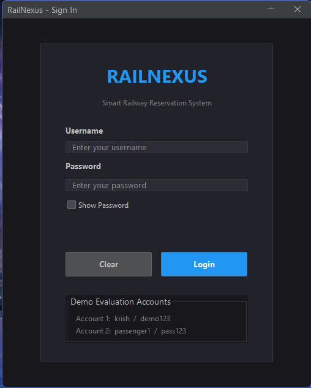
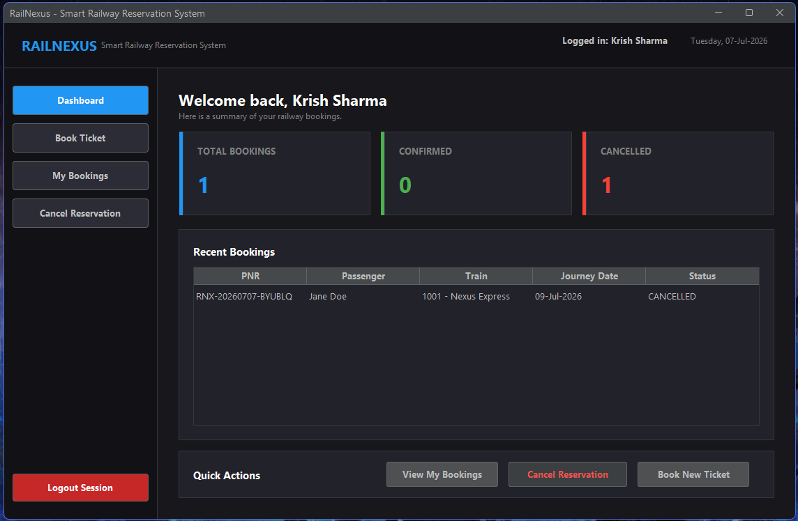
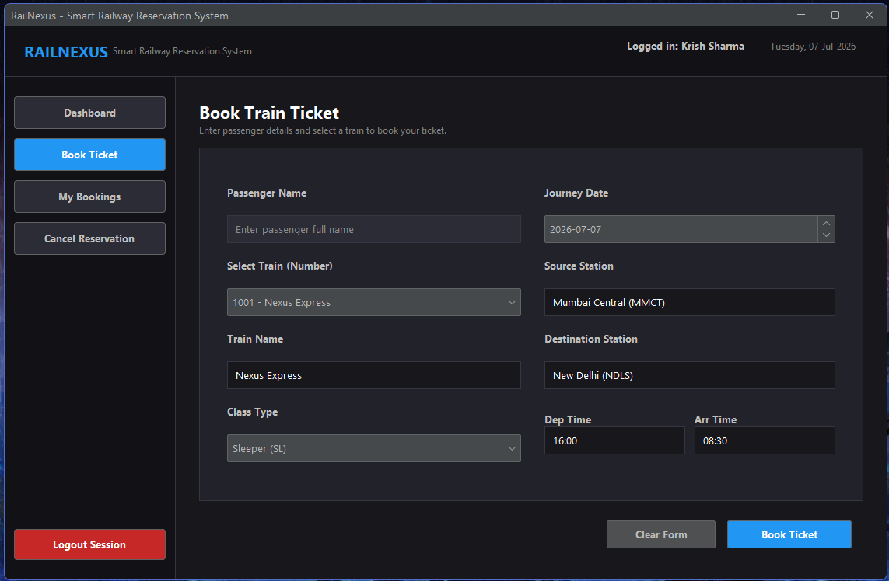
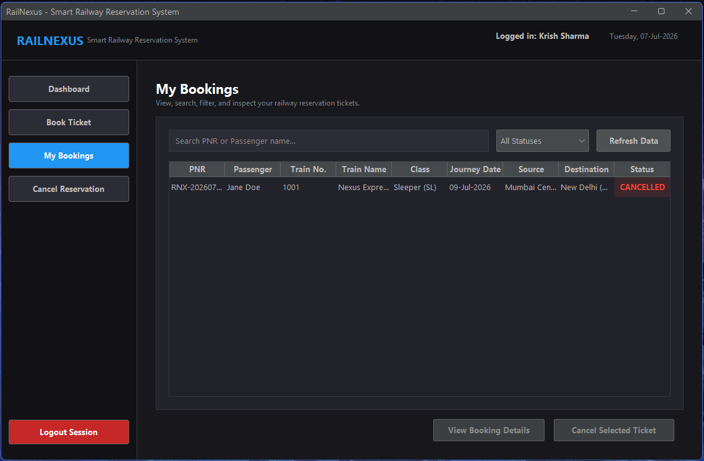
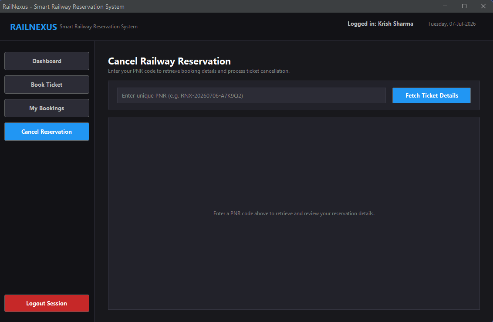

# RailNexus - Online Reservation System

RailNexus is a Java desktop application developed as **Task 1 of the Oasis Infobyte Java Development Internship**.

The project provides a simple railway reservation workflow where users can log in, book tickets, view their bookings, and cancel reservations. It is built using Java Swing, SQLite, and Maven with a layered architecture to keep the UI, business logic, and database operations separate.

## Features

- Secure user login with BCrypt password hashing
- Modern desktop interface built with Java Swing and FlatLaf
- Railway ticket booking with automatic train detail selection
- Input validation for passenger details and journey dates
- Unique PNR generation for every reservation
- View and search personal bookings
- Filter bookings by reservation status
- Cancel tickets using PNR
- User-level access control for reservations
- SQLite database with automatic initialization
- Parameterized SQL queries using PreparedStatements
- Unit and service-layer tests using JUnit 5

## Tech Stack

| Technology | Usage |
|---|---|
| Java 21 | Core application development |
| Java Swing | Desktop user interface |
| FlatLaf | Modern Look and Feel |
| SQLite | Local database |
| JDBC | Database connectivity |
| BCrypt | Password hashing |
| Maven | Dependency management and build |
| JUnit 5 | Testing |

## Application Modules

### Login

Users can log in using their credentials. Passwords are stored as BCrypt hashes instead of plain text.

### Dashboard

The dashboard displays booking statistics, recent reservations, and shortcuts to the main application features.

### Book Reservation

Users can select a train, enter passenger details and choose a journey date. Train information is filled automatically based on the selected train.

Before confirming the booking, the application displays a summary of the reservation details.

### My Bookings

Users can view their reservations, search by PNR or passenger name, filter bookings by status, and open detailed booking information.

### Ticket Cancellation

Users can search for their reservation using the PNR and cancel confirmed bookings.

A user can only access and cancel reservations associated with their own account.

## Project Structure

```text
Task1_RailNexus/
├── database/
│   ├── schema.sql
│   └── seed.sql
├── docs/
│   ├── DEMO_SCRIPT.md
│   ├── PROJECT_EXPLANATION.md
│   └── TEST_CASES.md
├── screenshots/
├── src/
│   ├── main/
│   │   ├── java/
│   │   │   └── com/krish/oibsip/reservation/
│   │   │       ├── config/
│   │   │       ├── dao/
│   │   │       ├── model/
│   │   │       ├── service/
│   │   │       ├── ui/
│   │   │       ├── util/
│   │   │       └── Main.java
│   │   └── resources/
│   └── test/
├── .gitignore
├── LICENSE
├── pom.xml
└── README.md
```

## How to Run

### Prerequisites

Make sure the following are installed:

- JDK 21 or later
- Git
- Apache Maven 3.x

### Clone the Repository

```bash
git clone https://github.com/Krish0968/OIBSIP.git
cd OIBSIP/Task1_RailNexus
```

### Run Tests

```bash
mvn clean test
```

### Build the Project

```bash
mvn clean package
```

### Run the Application

```bash
java -jar target/railnexus-1.0.0-jar-with-dependencies.jar
```

The SQLite database is initialized automatically when the application starts for the first time.

## Demo Credentials

| Username | Password |
|---|---|
| krish | demo123 |
| passenger1 | pass123 |

These accounts are included for project demonstration and testing.

## Testing

The project includes automated tests for:

- Password hashing and verification
- PNR generation and format validation
- Input and journey date validation
- Reservation service logic
- User authorization checks
- Duplicate cancellation handling

Run all tests using:

```bash
mvn clean test
```

## Database

RailNexus uses SQLite for local data storage.

The main database tables are:

- `users` - stores user accounts and password hashes
- `trains` - stores train and route information
- `reservations` - stores ticket bookings and reservation status

Foreign key constraints and indexes are used to maintain relationships and improve common reservation lookups.

## Screenshots

### Login Screen


### Dashboard


### Book Reservation


### My Bookings


### Ticket Cancellation


## Future Improvements

- Seat and coach allocation
- Printable ticket or PDF export
- Additional train search filters
- Admin dashboard for train management
- Migration to PostgreSQL or MySQL for multi-user deployment

## Author

**Krish**

Computer Science & Engineering Student at VIT  
Java Development Intern - Oasis Infobyte

GitHub: `Krish0968`
