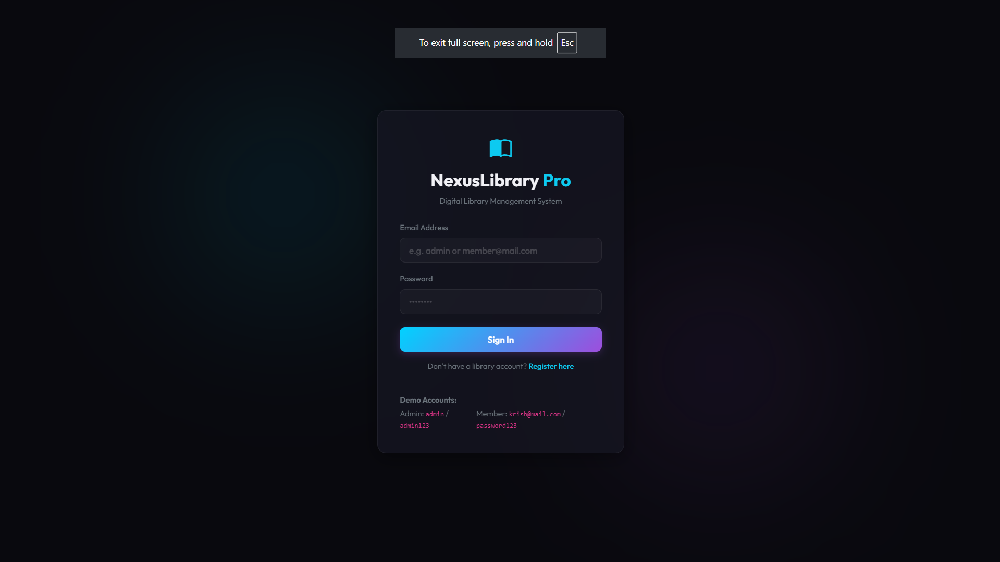
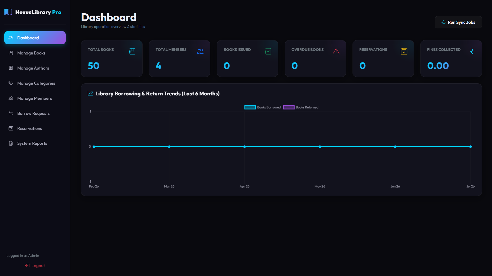
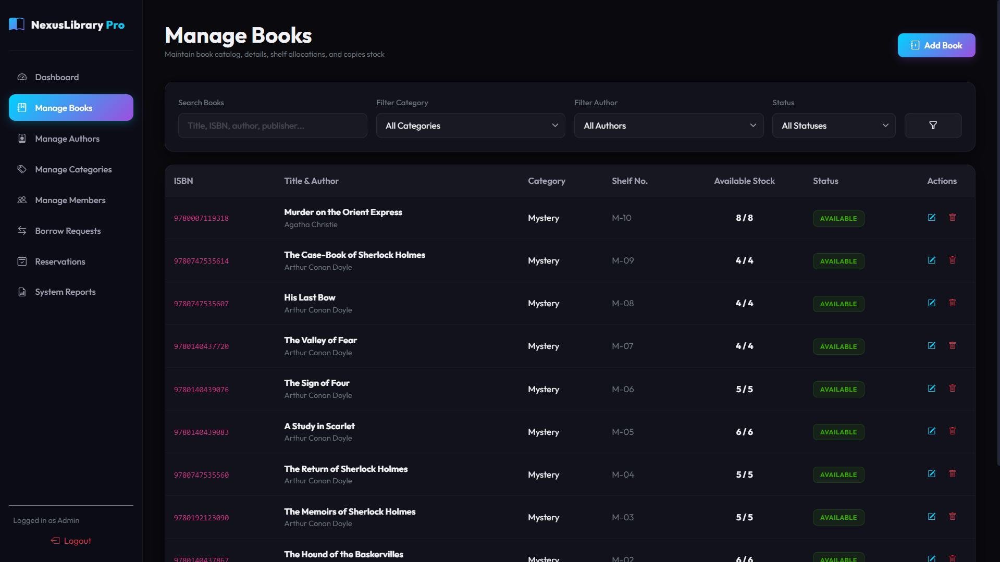
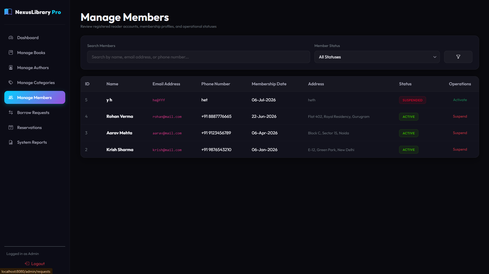
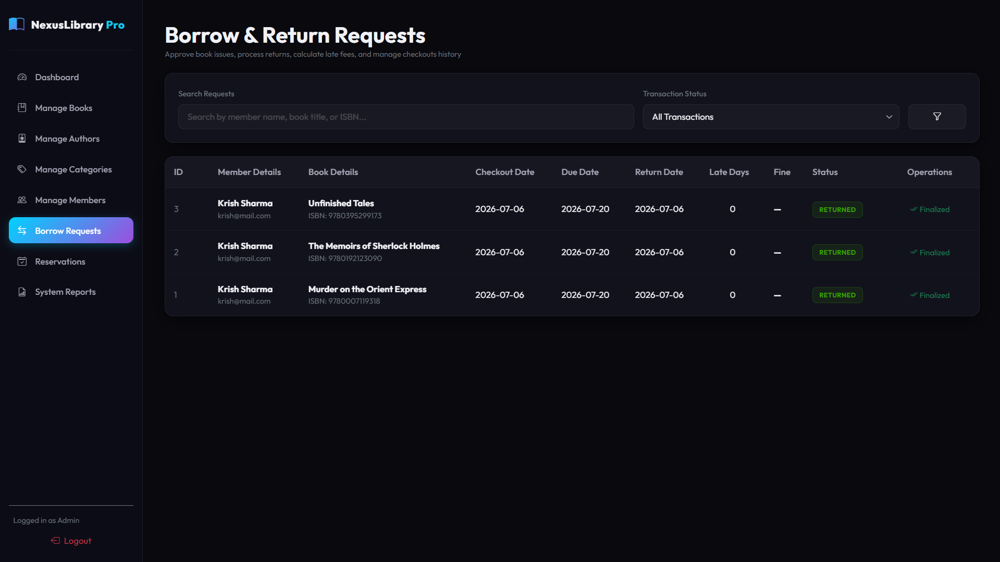
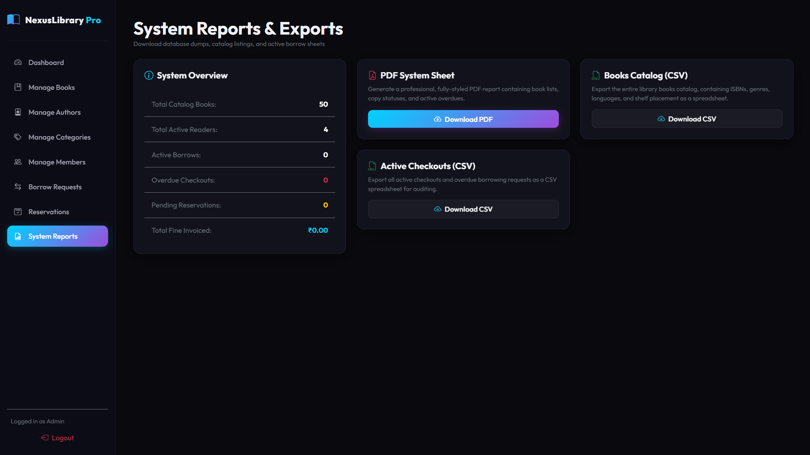
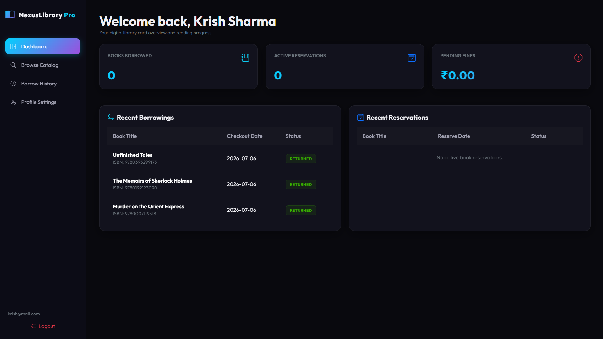
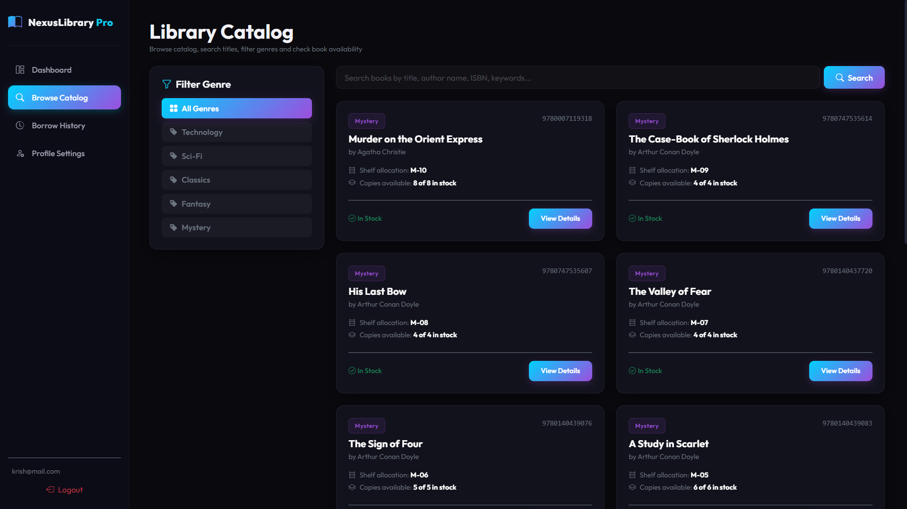

# NexusLibrary Pro - Digital Library Management System

NexusLibrary Pro is a web-based Digital Library Management System developed as **Task 5 of the Oasis Infobyte Java Development Internship**.

The application provides separate portals for administrators and library members. Administrators can manage books, members, authors, categories, borrow requests, reservations, and reports. Members can browse the catalog, request books, view their borrowing history, manage reservations, and update their profile.

The project is built using Java, Spring Boot, Spring Security, Spring Data JPA, Thymeleaf, Bootstrap, and SQLite.

## Features

### Admin Portal

- Dashboard with library statistics and activity overview
- Manage books with add, edit, delete, search, and filtering
- Manage authors and book categories
- View and manage registered members
- Activate or suspend member accounts
- Review and process borrow requests
- Manage return requests and book returns
- View and process book reservations
- Track overdue books and fines
- Export library reports in CSV and PDF formats
- Role-based access control for administrator pages

### Member Portal

- Member dashboard with borrowing and reservation statistics
- Browse and search the book catalog
- Filter books by category
- View book details and availability
- Request available books
- Reserve unavailable books
- Request book returns
- View borrowing history and reservation status
- Update profile information and password
- Role-based access control for member pages

## Tech Stack

| Technology | Usage |
|---|---|
| Java 21 | Core application development |
| Spring Boot | Web application framework |
| Spring MVC | Request handling and controllers |
| Spring Security | Authentication and role-based authorization |
| Spring Data JPA | Database access layer |
| Hibernate | ORM and entity management |
| Thymeleaf | Server-side HTML templates |
| Bootstrap 5 | Responsive user interface |
| SQLite | Local database |
| Maven | Dependency management and build |
| JUnit 5 | Testing |
| Chart.js | Dashboard charts |
| OpenPDF | PDF report generation |

## Application Modules

### Authentication

The application uses Spring Security for authentication and authorization.

Users are redirected to the appropriate dashboard based on their role. Administrator routes and member routes are protected separately.

### Dashboard

The administrator dashboard provides an overview of books, members, issued books, overdue records, reservations, and library activity.

The member dashboard displays current borrowings, reservations, fines, and recent library activity.

### Book Management

Administrators can add, update, delete, search, and filter books. Book availability is updated based on borrowing and reservation operations.

### Member Management

Administrators can view registered members and manage their account status.

Suspended members are prevented from creating new borrow requests and reservations.

### Borrowing and Returns

Members can request available books.

Administrators can review and approve or reject borrow requests. Members can request returns, which can then be processed by the administrator.

### Reservations

Members can reserve books when required.

Administrators can manage reservation requests and process active reservations.

### Reports

The reports module provides library statistics and allows administrators to export selected data in CSV and PDF formats.

## Project Structure

```text
Java-Task5-NexusLibraryPro/
├── database/
├── docs/
│   ├── DEMO_SCRIPT.md
│   ├── PROJECT_EXPLANATION.md
│   └── TEST_CASES.md
├── screenshots/
├── src/
│   ├── main/
│   │   ├── java/
│   │   │   └── com/oasis/nexuslibrary/
│   │   │       ├── config/
│   │   │       ├── controller/
│   │   │       ├── dto/
│   │   │       ├── entity/
│   │   │       ├── exception/
│   │   │       ├── mapper/
│   │   │       ├── repository/
│   │   │       ├── security/
│   │   │       ├── service/
│   │   │       └── util/
│   │   └── resources/
│   │       ├── static/
│   │       ├── templates/
│   │       └── application.properties
│   └── test/
├── .gitignore
├── LICENSE
├── pom.xml
└── README.md
```

## How to Run

### Prerequisites

Make sure the following are installed:

- JDK 21 or later
- Git
- Apache Maven 3.x

### Clone the Repository

```bash
git clone https://github.com/Krish0968/OIBSIP.git
cd OIBSIP/Java-Task5-NexusLibraryPro
```

### Run Tests

```bash
mvn clean test
```

### Build the Project

```bash
mvn clean package
```

### Run the Application

```bash
java -jar target/nexuslibrary-1.0.0-SNAPSHOT.jar
```

After the application starts, open the following address in your browser:

```text
http://localhost:8080
```

## Demo Accounts

The application initializes demo accounts for testing.

| Role | Username | Password |
|---|---|---|
| Administrator | admin | admin123 |
| Member | krish@mail.com | password123 |
| Member | aarav@mail.com | password123 |
| Member | rohan@mail.com | password123 |

These accounts are intended only for project demonstration and local testing.

## Testing

The project includes tests for core application functionality, including:

- Fine calculation
- Reservation workflow
- Security and authorization rules
- Database initialization and seeded data

Run the test suite using:

```bash
mvn clean test
```

## Database

NexusLibrary Pro uses SQLite for local data storage.

The main entities include:

- Members
- Books
- Authors
- Categories
- Issues
- Reservations

Spring Data JPA repositories and service classes are used to separate database operations from business logic.

## Screenshots

### Login Page


### Admin Dashboard


### Book Management


### Member Management


### Borrow and Return Requests


### Reports


### Member Dashboard


### Library Catalog


## Future Improvements

- Email notifications for due dates and reservations
- Barcode or RFID support for book management
- Online fine payment integration
- PostgreSQL or MySQL support for multi-user deployment
- Deployment using Docker and a cloud hosting platform

## License

This project is licensed under the MIT License. See the `LICENSE` file for details.

## Author

**Krish**

Computer Science & Engineering Student at VIT  
Java Development Intern - Oasis Infobyte

GitHub: `Krish0968`
