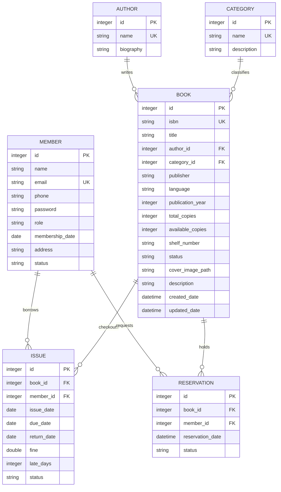

# NexusLibrary Pro - Architectural & Project Explanation

NexusLibrary Pro is designed as a modular, enterprise-grade Spring Boot application. This document details the architectural patterns, database schemas, security configurations, and design systems implemented in this system.

---

## 🏛️ Layered Software Architecture

The codebase follows the classic **Layered Architecture** with strict separation of concerns, ensuring high maintainability, testability, and adherence to SOLID principles.

```
                   +------------------+
                   |  Thymeleaf Views |
                   +--------+---------+
                            | HTTP Request / HTML Response
                   +--------v---------+
                   |   Controllers    |  (AuthController, AdminController, etc.)
                   +--------+---------+
                            | maps DTOs
                   +--------v---------+
                   |  Service Layer   |  (BookService, IssueService, etc. - Business rules)
                   +--------+---------+
                            | queries Entities
                   +--------v---------+
                   | Data Repositories|  (Spring Data JPA JpaRepositories)
                   +--------+---------+
                            | SQL / JDBC connection
                   +--------v---------+
                   | SQLite Database  |  (File-backed transactional store)
                   +------------------+
```

### 1. Presentation Layer (Controllers & Views)
- **Controllers**: Intercept HTTP requests, validate incoming payloads using the Spring Validation API, catch service exceptions, and bind data models to views.
- **Thymeleaf Views**: Renders server-side HTML template documents using model attributes. Utilizes fragments for reusable structures (navbars, sidebars, alerts) to avoid code duplication.
- **Global Exception Handler**: Intercepts unhandled controller exceptions (like `ResourceNotFoundException` or `BadRequestException`) and redirects them to customized error templates, passing localized error notifications via redirect attributes.

### 2. Service Layer (Business Logic)
- Implements the core domain rules (e.g. max checkouts count, fine rates, reservation expiry times, account suspensions).
- Uses declarative Spring `@Transactional` annotations to guarantee database atomic transactions.
- Integrates mappers to isolate database entities from controller responses, exposing clean DTO projections.

### 3. Data Access Layer (Repositories & JPA)
- Uses **Spring Data JPA** interfaces extending `JpaRepository` to perform CRUD operations.
- Custom query methods write optimized JPQL statements mapping search criteria and status filters.
- Uses entity lifecycle hooks (`@PrePersist` and `@PreUpdate`) to maintain timestamps and book stock availability dynamically.

---

## 💾 SQLite Database Schema

The system uses SQLite, configured with foreign key constraints enabled on connection startup:
`jdbc:sqlite:database/nexuslibrary.db?foreign_keys=true`

### Entity-Relationship (ER) Schema Layout
The database schema consists of six tables, normalized to Third Normal Form (3NF) to prevent data anomalies.



### Table Relationships & Cascades
- **Books - Author & Category**: Each book belongs to exactly one author and one category (Many-to-One). If an author or category is deleted, a validation check prevents the deletion if books still reference them.
- **Issues - Book & Member**: Each checkout maps to one book and one member (Many-to-One). 
- **Reservations - Book & Member**: Each reservation hold maps one book to one member (Many-to-One).

---

## 🔒 Security Architecture (Spring Security)

Authentication and authorization are managed by **Spring Security 6**, securing URLs based on user roles:

### 1. Filter Chains & Route Restrictions
- **Public Routes**: `/login`, `/register`, `/css/**`, `/js/**`, `/images/**` are accessible by any visitor.
- **Administrator Routes**: `/admin/**` requires the role `ROLE_ADMIN`.
- **Member Routes**: `/member/**` requires the role `ROLE_MEMBER`.
- **Any Other Route**: Authenticated sessions only.

### 2. Credential Verification
- Authentications query `CustomUserDetailsService` which pulls user email matches from the `members` database table.
- Credentials map roles and status locks.
- Password hashes are verified using `BCryptPasswordEncoder` configured with a strength of 10.
- Login successes invoke `customSuccessHandler`, redirecting administrators to `/admin/dashboard` and readers to `/member/dashboard` respectively.

---

## ⚙️ Core Library Business Logic Workflows

### 1. Book Borrowing Lifecycle
```
[Member Catalog] --(Request Borrow)--> [REQUESTED status]
                                                |
                                        [Admin Approves] --(Stock -1)
                                                |
                                          [ISSUED status] --(Sets Due Date: today + 14d)
                                                |
                                        [Member Returns]
                                                |
                                    [RETURN_REQUESTED status]
                                                |
                                        [Admin Confirms] --(Calculates Fine & Stock +1)
                                                |
                                         [RETURNED status]
```

### 2. Fine Calculations
- The system checks if `returnDate` (or `today` for active issues) is after `dueDate`.
- Late days are calculated as the difference: `lateDays = ChronoUnit.DAYS.between(dueDate, date)`.
- Fines are calculated as: `fine = lateDays * fineRatePerDay` (default rate is ₹10.00/day, configurable in properties).
- Overdue jobs are triggered automatically or manually from the dashboard.

### 3. Book Reservations & Expirations
- A reader can reserve any book (normally used for Out-of-Stock books).
- When a book becomes available, the admin can approve the reservation:
  - Decrements available copies by 1, placing it on "Hold" for that member.
  - Changes reservation status to `APPROVED` and sets `reservationDate` to current timestamp.
- The member has a 3-day hold window to pick up the book:
  - If picked up: Admin clicks "Fulfill", which converts the reservation to an active `ISSUED` checkout.
  - If not picked up within 3 days: The system job marks the reservation as `CANCELLED` and re-injects the copy back to stock (`availableCopies` + 1).
